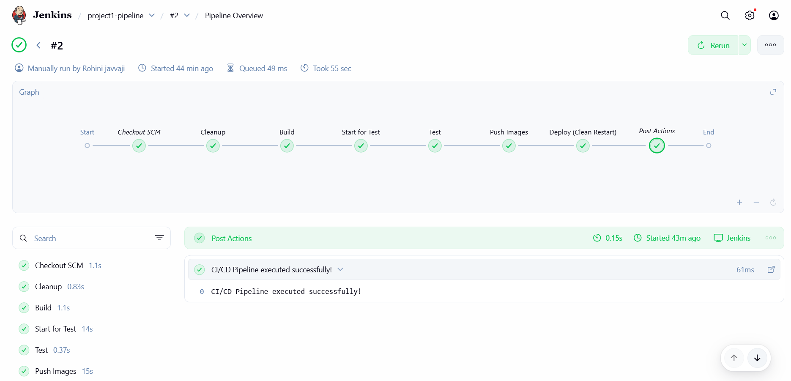
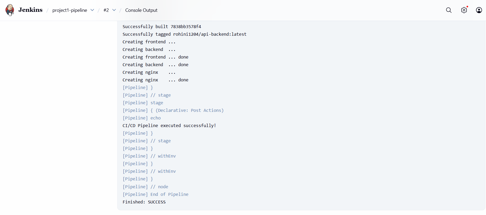
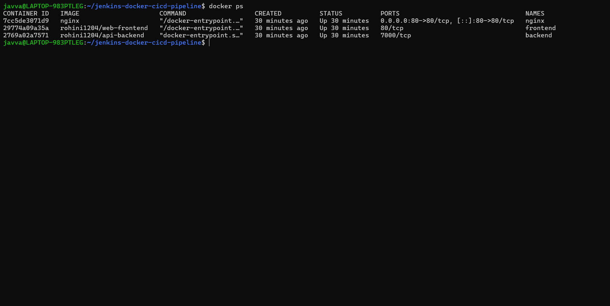
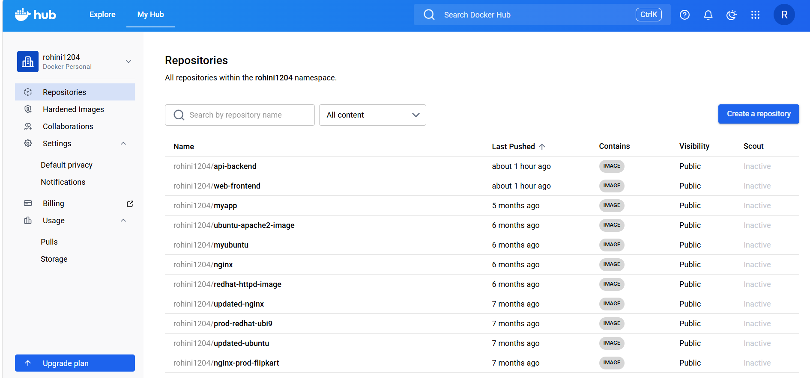
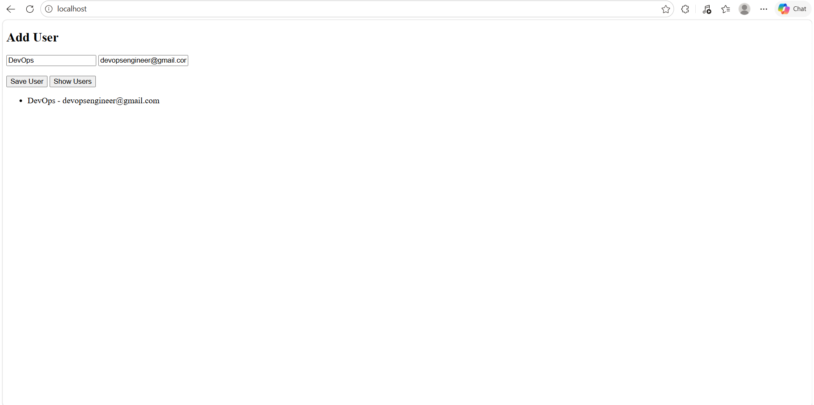

# 🚀 Automated CI/CD Pipeline for Containerized Application using Jenkins, Docker & Nginx

## 📖 Project Overview
This project implements an end-to-end CI/CD pipeline using Jenkins, Docker, and Nginx to automate the build, test, push, and deployment of a containerized multi-service application. The system includes a frontend, backend, and Nginx reverse proxy, all managed using Docker Compose.

Jenkins orchestrates the entire pipeline, while Docker ensures consistent containerized environments. Docker Hub is used as a container registry, and Nginx handles request routing between services. The project demonstrates real-world DevOps practices by automating the software delivery lifecycle and reducing manual deployment efforts.

---

## 🏗️ Architecture

This project follows a containerized architecture using Docker Compose to manage multiple services including frontend, backend, and Nginx. Nginx acts as a reverse proxy to route user requests to the appropriate service.

All services run inside isolated Docker containers to ensure consistency and scalability. The CI/CD pipeline using Jenkins automates the process of building, testing, pushing, and deploying the application.

### System Flow

```text
User → Nginx → Frontend / Backend  
             ↓  
     Docker Compose  
             ↓  
  Jenkins CI/CD Pipeline  
             ↓  
         Docker Hub 
```
---

## 🛠️ Tech Stack

- Jenkins - CI/CD automation server
- Docker - Containerization platform
- Docker Compose - Multi-container orchestration
- Nginx - Reverse proxy server
- GitHub - Version control and repository hosting
- DockerHub - Container image registry
- Linux - Deployment environment

---

## 📁 Project Structure

```text
.
├── Jenkinsfile
├── docker-compose.yml
├── frontend
│   ├── Dockerfile
│   └── index.html
├── backend
│   ├── Dockerfile
│   ├── package-lock.json
│   ├── package.json
│   └── server.js
├── nginx
│   └── nginx.conf
└── screenshots
    ├── application-ui.png
    ├── docker-containers.png
    ├── docker-hub.png
    ├── jenkins-console-output.png
    └── jenkins-pipeline-stage-view.png
├── README.md
```

---

## ⚙️ CI/CD Pipeline Workflow

The CI/CD pipeline is implemented using Jenkins to automate the entire software delivery process.

### Pipeline Stages

1. **Build Stage**
   - Docker images are built for frontend and backend services.

2. **Test Stage**
   - Basic validation is performed to ensure the application is running correctly.

3. **Push Stage**
   - Docker images are pushed to Docker Hub for version control and storage.

4. **Deploy Stage**
   - Containers are deployed using Docker Compose and made accessible via Nginx.

### Pipeline Flow

Build → Test → Push → Deploy

---

## 🚀 How to Run Locally
```bash
git clone
https://github.com/RohiniJ1204/jenkins-docker-cicd-pipeline.git

cd jenkins-docker-cicd-pipeline

docker-compose up -d
```

---

## 📸 Screenshots

### Jenkins Pipeline Overview



### Console Output



### Docker Containers



### Docker Hub Images



### Application UI


---

## 🧠 Key DevOps Concepts Demonstrated

- Continuous Integration & Continuous Deployment (CI/CD)
- Docker containerization
- Automated build & deployment pipelines
- Container lifecycle management
- Docker Compose orchestration
- Jenkins pipeline automation
- Health check validation
- Docker image versioning & registry integration

---

## 🚀 Future Enhancements

- Kubernetes deployment support
- Blue-Green deployment strategy
- Monitoring with Prometheus & Grafana
- Automated rollback on deployment failure
- Terraform-based infrastructure provisioning

---

## 👨‍💻 Author

**Rohini Javvaji**
- Aspiring DevOps Engineer
- GitHub: https://github.com/RohiniJ1204

---

⭐ This project demonstrates practical implementation of CI/CD automation and containerized deployments using modern DevOps tools.

---


